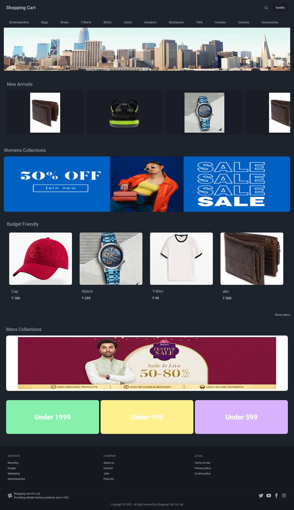
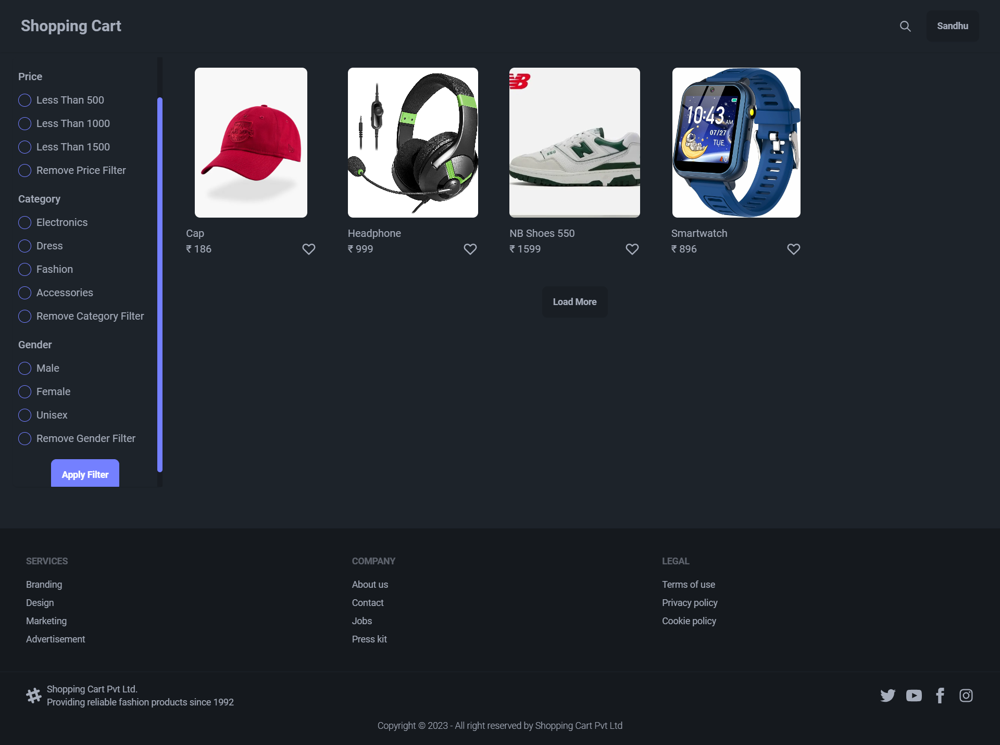
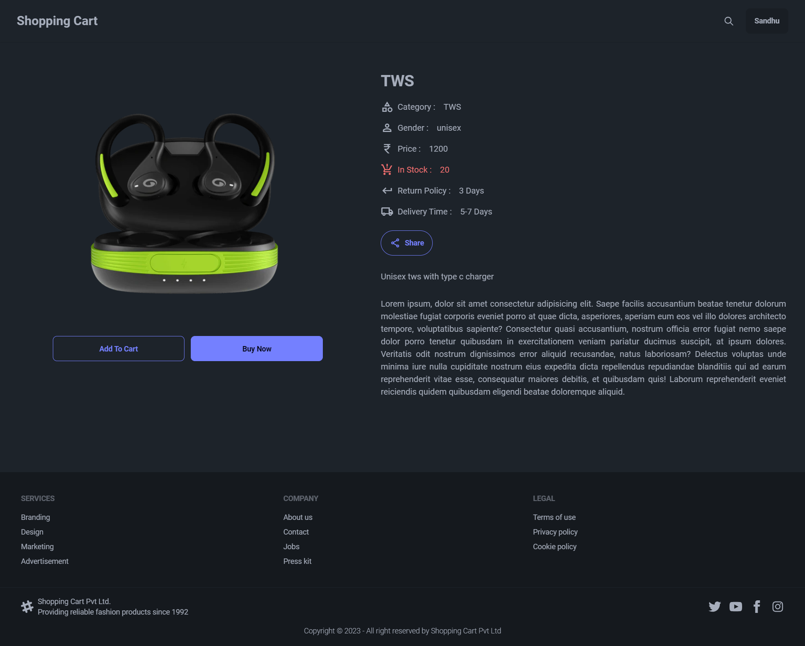
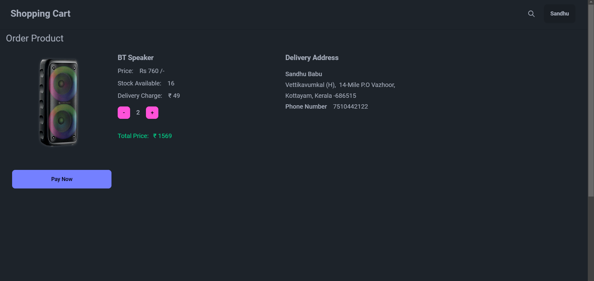
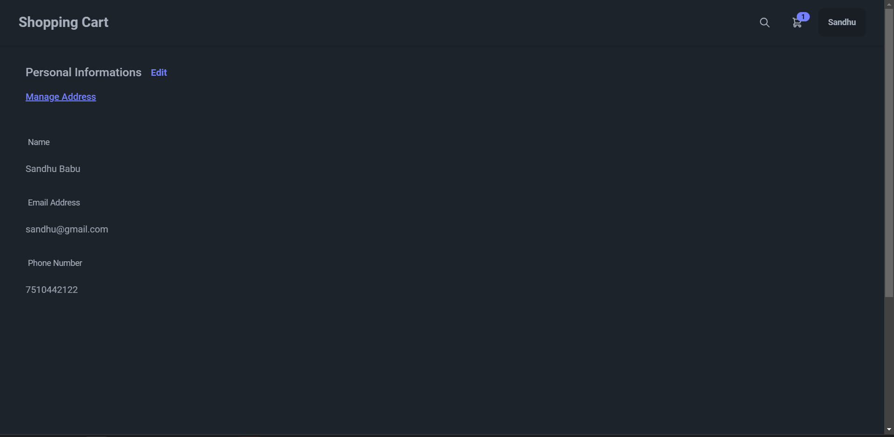
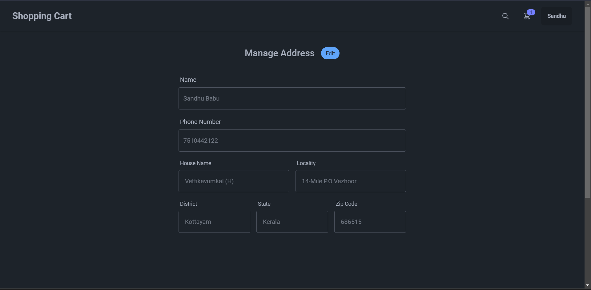
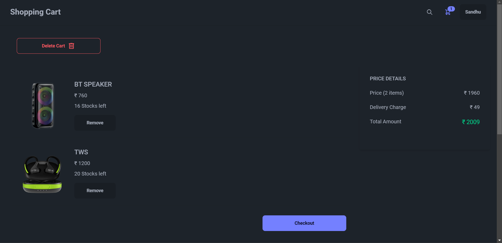

# E-Commerce Website React 

## Run Project
1) git clone https://github.com/SandhuBabu/shopping-cart-frontend.git
2) npm i
3) cd shopping-cart-frontend
4) npm run dev

Sample Images:

## Sign Up

## Home Page Of User

## Search Products

## Product Details

## Order Product

## All Orders

## Profile

## Address Details

## Cart

